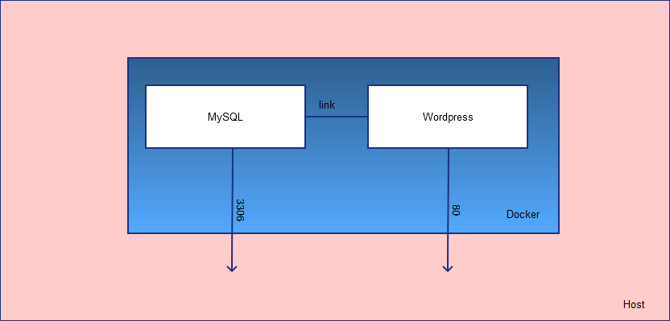
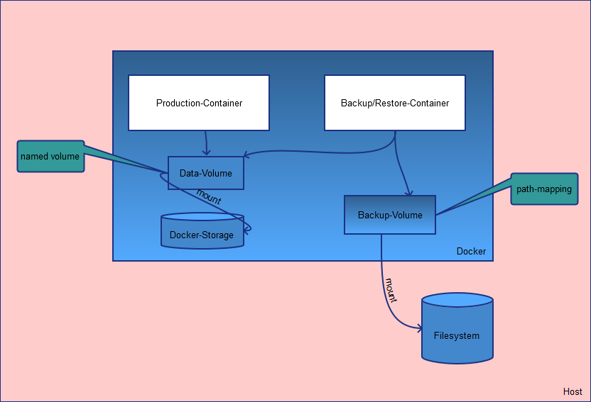

# Docker

Crash-Kurs

## Cheats

* Logs anschauen mit `docker logs $container-name [-f]`  
* Meta-Daten abgreifen mit `docker inspect $container-name`
* in einen laufenden Container springen mit `docker exec -it $container-name bash`
* Container löschen `docker rm $name`
* Container Listing `docker ps --all`

* Dockerfile bauen `docker build -t $image-name $folder_on_host`

* Aufräumen nach run `docker run --rm ...` (entfernt den Container nach dem Lauf sowie alle anonymen gemounteten Volumes)

* Auflistung aller Netzwerke: `docker network ls`

* MySQL Variablen abrufen `SHOW VARIABLES like '%conn%'`

## Datenbank mit Docker (Am Beispiel MySQL)

`docker pull mysql`

### Einfacher Start MySQL im Container

    docker run --detach --name=test-mysql --env="MYSQL_ROOT_PASSWORD=root" mysql

Unter Windows zum Testen:

    docker run --detach --name=test-mysql --env="MYSQL_ROOT_PASSWORD=root" --publish 3306:3306 mysql

### Anpassung der Konfiguration

Verlinkung einer lokalen Datei in den Container

    mkdir -p /path/to/custom-conf && touch /path/to/custom-conf/my-custom-conf.cnf
    docker run \
    --detach \
    --name=test-mysql \
    --env="MYSQL_ROOT_PASSWORD=root" \
    --volume /path/to/custom-conf:/etc/mysql/conf.d \
    mysql

### Hinzufügen eines Data-Volumes in das MySQL

    mkdir -p /path/to/data
    docker docker run \
    --detach \
    --name=test-mysql \
    --env="MYSQL_ROOT_PASSWORD=root" \
    --volume /path/to/custom-conf:/etc/mysql/conf.d \
    --volume /path/to/data:/var/lib/mysql \
    mysql

Jetzt kann man beliebig `docker stop` und `docker start` auf den MySQL Container ausführen, ohne dass die Daten verloren gehen.  
Wenn das Datenverzeichnis schon existiert, wird der Parameter `--env="MYSQL_ROOT_PASSWORD=mypassword"` obsolet.

### Anpassung des Images (Erzeugung einer Default-Tabelle)

Siehe Beispiel in `01_costum_mysql`

    mkdir sql-scripts
    touch sql-scripts/createTable.sql
    touch sql-scripts/insertData.sql

Inhalt:

    // createTable.sql
    CREATE TABLE employees (
    first_name varchar(25),
    last_name  varchar(25),
    department varchar(15),
    email  varchar(50)
    );

    // insertData.sql
    INSERT INTO employees (first_name, last_name, department, email)
    VALUES ('Mike', 'Boddin', 'dev', 'mike.boddin@localhost')

Dockerfile anlegen mit folgendem Inhalt:

    FROM mysql

    # Add a database
    ENV MYSQL_DATABASE company

    # Add the content of the sql-scripts/ directory to your image
    # All scripts in docker-entrypoint-initdb.d/ are automatically
    # executed during container startup
    COPY ./sql-scripts/ /docker-entrypoint-initdb.d/

Bauen und starten

    docker build -t custom-mysql .
    docker run -d -p 3306:3306 --name dev-mysql -e MYSQL_ROOT_PASSWORD=root custom-mysql

## Volumes

`--volume` bzw `-v` besitzt drei Felder `[host-src:]container-dest[:<options>]`

* `host-src` absoluter Pfad auf dem Host oder Name eines Volume-Containers (wird erstellt, wenn nicht vorhanden)
* `container-dest` absoluter Pfad im Container
* Komma-separierte `options`, die wichtigste:
  * `[rw|ro]`: read-write-Modus (`read-write` bzw `read-only`)

Alternative: `--volumes-from=""` (alle Volumes aus einem anderen Container mounten)

### Binding-Varianten

    volumes:
    # anonymes Volume (nur Angabe des Pfads im Container)
    - /var/lib/mysql

    # Pfad-Mapping $host_path:$container_path
    - /opt/data:/var/lib/mysql

    # (nur docker-compose) Pfadmapping mit relativem Pfad
    - ./cache:/tmp/cache

    # (nur docker-compose) Pfadmapping mit relativem Pfad vom $USERHOME aus
    - ~/configs:/etc/configs/:ro

    # Named Volume
    - datavolume:/var/lib/mysql

### --mount vs. --volume

* `--mount` war ursprünglich nur für swarms gedacht
* mittlerweile geht `--mount`auch mit standalone-Containern
* für docker-compose ist nur `mount` verfügbar
* Unterschied zu `--volume` ist im Wesentlichen nur die Syntax

      --mount '$key1=$value1,$key2=$value2,...'

* Properties (keys) sind:
  * `type` (`bind`, `volume`, `tmpfs`)
  * `source` bzw `src` (Pfad oder Name)
  * `destination` bzw `dst` bzw `target` (absoluter Pfad im Container)
  * `readonly`
  * `volume-opt=$option=$optionvalue` kann mehrfach auftauchen, Volume-Optionen

vgl. <https://docs.docker.com/storage/volumes/#choose-the--v-or---mount-flag>

## Docker-Instanzen verlinken

    docker run --detach --name test-wordpress --link test-mysql:mysql --publish 8080:80 wordpress

* schauen, ob die Verlinkung funktioniert hat
* mit wordpress verbinden und `cat /etc/hosts` aufrufen

Die wichtigsten Umgebunsvariablen des wordpress-Images haben defaults, die zum offiziellen `mysql`-Image passen, darum kann man via `link` beide Instanzen mit wenig Konfiguration gemeinsam starten.

siehe: <https://hub.docker.com/_/wordpress/>

## Publish Ports

* `--publish $public_port:$instance_port$`

        docker run --detach --name=test-mysql --env="MYSQL_ROOT_PASSWORD=root" --publish 6603:3306 mysql

## Docker Compose

* Am Beispiel Wordpress + MySql --> siehe `02_docker_compose/docker_compose.yml`

* Verknüpfung von mehreren Docker-Containern ("Services") via config-File (compose-file)
* benutzte Volumes werden nicht gelöscht, sondern wiederverwendet

* `docker-compose up` startet die im compose-file definierte Applikation
* es können docker-spezifische Umgebungsvariablen benutzt werden: <https://docs.docker.com/compose/reference/envvars/>

Nach einem Update der Services (z.B. anheben der Version) wird einfach erneut `docker-compose up` ausgeführt und die Container werden einfach ersetzt.

### link vs depends_on

Beide Properties steuern die Verknüpfung zwischen Containern um diese untereinander erreichbar zu machen.

`depends_on` legt zusätzlich zum Verlinken auch die Startreihenfolge der Services fest.

### restart policy

GIbt an, wie sich ein Container im Fehlerfall (crash) verhalten soll.  
Es gibt 4 mögliche Policies, der default ist `no`

    restart: "no"
    restart: always
    restart: on-failure
    restart: unless-stopped

Ab Version 3 der compose-file, wird dieses property im Falle eines Swarm-Deploys ignoriert.  
Stattdessen muss dort `restart_policy` benutzt werden.  

<https://docs.docker.com/compose/compose-file/#restart_policy>

### Auwahl des Images für einen Service

Man kann vom Image bauen oder von einer Dockerfile direkt (`build` vs `image`).

### expose: Ports für andere Container freischalten

    expose:
        - "$port1"
        - "$port2"

### Netzwerke

`docker network ls`

Man kann im docker-compose komplexere Netzwerktopologien definieren um Services und Service-Gruppen weiter voneinander zu isolieren. Beispiel:

    version: "3"
    services:

    proxy:
        build: ./proxy
        networks:
        - frontend
    app:
        build: ./app
        networks:
        - frontend
        - backend
    db:
        image: postgres
        networks:
        - backend

    networks:
    frontend:
        # Use a custom driver
        driver: custom-driver-1
    backend:
        # Use a custom driver which takes special options
        driver: custom-driver-2
        driver_opts:
        foo: "1"
        bar: "2"

#### Driver

Die wichtigsten driver für Netzwerke sind `bridge` (default) und `overlay` (ähnlich einem VPN; für multi-Host-Deployments)

### Environment-Variablen

Können direkt definiert werden via `environment:` oder per Datei:

    env_file: .env
    # oder
    env_file: [$file1, $file2, ...]

### externe Services einbinden

Sofern man Services so definiert hat, dass sie im gleichen Netzwerk leben (siehe oben), kann man auch externe Services verlinken:

    services:
      web:
        external_links:
          - redis_1
          - project_db_1:mysql

## docker secrets

Um Passwörter sicher zum Container zu schicken.  
Siehe Doku vom `mysql` Image: <https://hub.docker.com/_/mysql/>

## Backup/Restore von Volumes

<https://bitbucket.org/scorb/de.scorban.demo.wordpress/src/master/docker-volume-backup/>

## Docker in production

<https://docs.docker.com/config/labels-custom-metadata/#manage-labels-on-objects>

## Swarms und Stacks

Als Weiterführung von `docker-compose` kann man via stack-deploy oder swarm-deploy meherere Applikationen über multiple Hosts miteinander verbinden. Weiterhin wird hier die horizontale Skalierung von Service-Instanzen ermöglicht.  
Hier kommt dann auch `Kubernetes` ins Spiel.